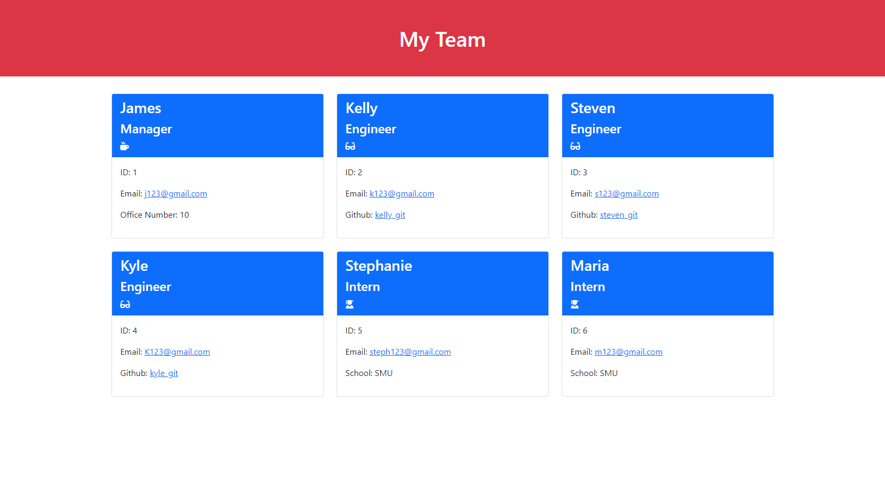

# Team Profile Generator 

 A node.js command-line application that takes the employee information inputted by the user and creates a clean HTML that displays the software engineering team made.
## Table of Contents
    
- [Installation](#installation)
- [Objectives](#objectives)
- [Screenshot](#screenshot)
- [Video](#video)
- [Credits](#credits)
- [Contributing](#contributing)
- [Tests](#tests)
- [Questions](#questions)
- [License](#license)

## Installation

1. Open the terminal
2. Clone the repo: https://github.com/Emily-MVaz/team-profile-generator
3. Cd into new directory and into Develop folder
4. Download Inquirer package by entering npm i
5. Enter node index.js into the terminal
6. Follow the prompts provided

## Objectives
Main Objective: Create a Node.js command-line application that generates a webpage that displays my team's basic info so that I have quick access to their emails and GitHub profiles.

```md
GIVEN a command-line application that accepts user input
WHEN I am prompted for my team members and their information
THEN an HTML file is generated that displays a nicely formatted team roster based on user input
WHEN I click on an email address in the HTML
THEN my default email program opens and populates the TO field of the email with the address
WHEN I click on the GitHub username
THEN that GitHub profile opens in a new tab
WHEN I start the application
THEN I am prompted to enter the team manager’s name, employee ID, email address, and office number
WHEN I enter the team manager’s name, employee ID, email address, and office number
THEN I am presented with a menu with the option to add an engineer or an intern or to finish building my team
WHEN I select the engineer option
THEN I am prompted to enter the engineer’s name, ID, email, and GitHub username, and I am taken back to the menu
WHEN I select the intern option
THEN I am prompted to enter the intern’s name, ID, email, and school, and I am taken back to the menu
WHEN I decide to finish building my team
THEN I exit the application, and the HTML is generated
```
## Screenshot




## Video

Tests:


Command-line:


## Credits

Used the following sources:
- [Sitepoint](https://www.sitepoint.com/understanding-module-exports-exports-node-js/)
- [Bootstrap Documentation](https://getbootstrap.com/docs/5.0/getting-started/introduction/)
- [Stack Overflow validation question](https://stackoverflow.com/questions/46155/whats-the-best-way-to-validate-an-email-address-in-javascript?page=4&tab=Votes)
- [Stack Overflow extend class question](https://stackoverflow.com/questions/39591277/react-differences-between-component-create-with-extend-class-and-simple-const)
- [Mozilla Developer](https://developer.mozilla.org/en-US/docs/Web/JavaScript/Reference/Operators/super)

## Contributing

If you would like to contribute to this project feel free to reach out at the email provided below. By contributing, you agree that your contributions will be licensed under its MIT License.
## Tests

There are 4 tests one for each employee role and the general employee. Simply open the terminal and run npm run test to see if each test will run and pass

  

## Questions

Visit my [GitHub](https://github.com/Emily-MVaz)
  
  If you have any additional questions please email me at emily.m.vazquez99@gmail.com
## License

Licensed under the [MIT](https://choosealicense.com/licenses/mit/) License

